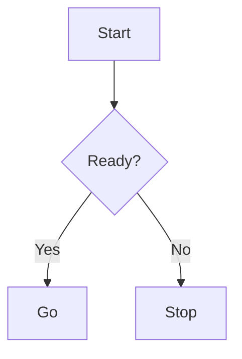

# 🧩 Marp + Mermaid + Python Diagrams Template

A fully reproducible Marp workflow that **pre-renders diagrams inside Markdown** — using
[Mermaid](https://mermaid.js.org/), [Python Diagrams](https://diagrams.mingrammer.com/), and [Marp](https://marp.app/).  
Perfect for tech slides, architecture decks, and reproducible documentation.

---

## ✨ Features

- ` ```mermaid` → rendered via **Kroki API** (or local Kroki container)
- ` ```diagrams` → rendered via **Python Diagrams + Graphviz**
- Outputs consistent **HTML + PDF** slides with no manual export
- Always produces a unified output:
  - `dist/current.marp.md`, `dist/current.html`, `dist/current.pdf`
- Runs fully **offline** with local Kroki
- Ready for **team workflows / CI builds**
- 100% reproducible & version-controlled

---

## 🧰 Requirements

| Component | Version / Package |
|------------|------------------|
| **OS** | Ubuntu 22.04+ / WSL2 recommended |
| **Node.js** | 18 – 22 |
| **Python** | 3.9+ |
| **System** | `graphviz` (for diagrams) |
| **Browser** | Chromium (for Marp PDF; Marp CLI downloads a compatible headless build automatically) |
| **Optional** | Docker (for local Kroki) |

---

## 🚀 Quick Start

```bash
# 1. System dependencies
sudo apt update
sudo apt install -y graphviz chromium-browser docker.io

# 2. Python virtual environment (recommended)
# Ubuntu 24.04+ enforces PEP 668 — use a venv to avoid "externally managed" errors
python3 -m venv .venv
source .venv/bin/activate
pip install -U pip
pip install -r requirements.txt

# (If you skip venv, add `--break-system-packages` to pip commands — not recommended)
# This ensures all Python packages are installed locally inside the project (not system-wide).

# 3. Node deps
npm ci
```

---

## 🧩 Local Kroki Server (optional, for offline rendering)

If `https://kroki.io` is unreachable or rate-limited,
you can spin up a **local Kroki + Mermaid renderer** easily:

```bash
# Stop existing containers (optional)
docker rm -f kroki kroki-mermaid 2>/dev/null || true

# Start Mermaid renderer
docker run -d --name kroki-mermaid yuzutech/kroki-mermaid

# Start Kroki API (linking to Mermaid)
docker run -d --name kroki -p 8000:8000 \
  -e KROKI_MERMAID_HOST=kroki-mermaid \
  -e KROKI_MERMAID_PORT=8002 \
  --link kroki-mermaid \
  yuzutech/kroki
```

Then export this before running builds:

```bash
export KROKI_URL=http://localhost:8000
```

> 💡 In CI builds, if `KROKI_URL` is unset or unreachable, it automatically falls back to [https://kroki.io](https://kroki.io).

---

## 🧱 Build Workflow

```bash
# Default: src/sample.md → dist/current.*
npm run build:all

# Custom source file
npm run build:all --md=src/mydeck.md

# or (recommended for quieter logs)
npm run build:all -- --md=src/mydeck.md

# HTML only / PDF only
npm run build:html -- --md=src/mydeck.md
npm run build:pdf -- --md=src/mydeck.md
```

### Output structure

```text
dist/
 ├── current.marp.md       ← latest processed Markdown (Marp input)
 ├── sample.marp.md        ← archived processed version of src/sample.md
 ├── current.html          ← rendered HTML slides
 ├── current.pdf           ← rendered PDF slides
 └── assets/
      ├── mmd-xxxxx.svg    ← Mermaid outputs
      └── diag-xxxxx.png   ← Python Diagrams outputs
```

> 💡 `current.*` is a common output that is always overwritten by the latest build.
> It provides steady ops in team builds and automated runs.

---

## 🪄 Usage in Markdown

````markdown
## Mermaid



---

## Python Diagrams

```diagrams {title:"MultiCloud", format:"png"}
from diagrams import Cluster
from diagrams.onprem.gitops import ArgoCD
from diagrams.aws.compute import EKS
from diagrams.azure.compute import AKS
from diagrams.gcp.compute import GKE

with Cluster("Hub: Control Plane"):
    argo = ArgoCD("Argo CD")

eks = EKS("EKS + Bedrock")
aks = AKS("AKS + OpenAI")
gke = GKE("GKE + Gemini")

argo >> eks
argo >> aks
argo >> gke
```
````

---

## ⚙️ Customization

- `{format:"png"}` or `{format:"svg"}` to control image output per block
- `{title:"My Diagram"}` adds a title (for Python Diagrams)
- Modify [`scripts/preprocess.mjs`](./scripts/preprocess.mjs) to add new fence types or adjust defaults
- PDF font fallback can be configured via `~/.config/marp/` if Japanese text breaks

---

### 🐍 Python Environment

> For stable builds, always use a **virtual environment** (`.venv`).

Ubuntu 24.04+ (and Debian Bookworm+) enforces PEP 668, which blocks global pip installs.  
This template assumes:

```bash
python3 -m venv .venv
source .venv/bin/activate
pip install -r requirements.txt
```

so that Python dependencies (`diagrams`, `graphviz`, etc.) are isolated and reproducible.

---

## 🧼 Clean up

Removes `dist/` and regenerates on next build.

```bash
npm run clean
```

---

## ☁️ Continuous Build (GitHub Actions)

This template includes a ready-to-use CI workflow:

- Runs automatically on every push to `main`
- Builds HTML & PDF slides via Marp + Kroki + Python Diagrams
- Uploads results as GitHub Actions artifacts

File: [`.github/workflows/build.yml`](.github/workflows/build.yml)

---

## 🧩 Template Repository Usage

This repository is designed to be forked as a **template repository**.
You can click **“Use this template”** on GitHub to instantly start your own diagram-powered Marp project.
It works great as a personal portfolio base or an internal documentation generator.

---

## 🪪 License

### MIT License

Feel free to fork, remix, and use this as your own slide generator or developer portfolio base.
Attribution is appreciated but not required — this project was designed to be *copied, customized, and improved.*

---

### 🧠 Author

Created and maintained by **[rbcn](https://github.com/rbcn/)**

> “Automate the boring parts of documentation.”
