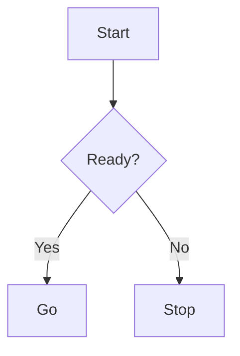

# Sample Presentation

## Mermaid



---

## Python Diagrams（PNG）

```diagrams {title:"MultiCloud", format:"png"}
from diagrams import Cluster
from diagrams.onprem.gitops import ArgoCD
from diagrams.aws.compute import EKS
from diagrams.azure.compute import AKS
from diagrams.gcp.compute import GKE

with Cluster("Hub: Control Plane"):
    argo = ArgoCD("Argo CD")

eks = EKS("EKS + Bedrock")
aks = AKS("AKS + OpenAI")
gke = GKE("GKE + Gemini")

argo >> eks
argo >> aks
argo >> gke
```
